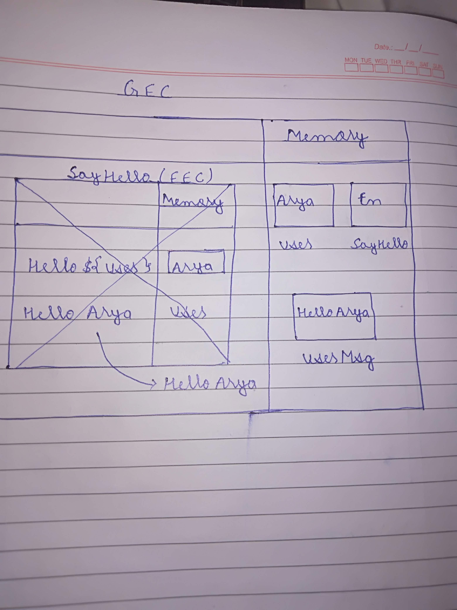
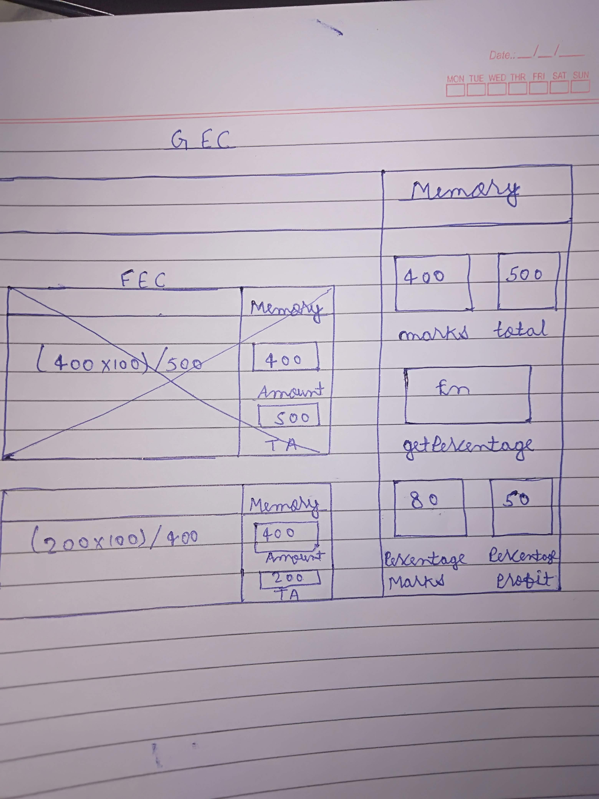

1. What does thread of execution means in JavaScript?

// It does two things. One, it goes through our code, line by line. There's a block of code we're gonna work through right now. It goes through it line by line, and does each of the line of code, they call this the thread of execution.

2. Where the JavaScript code gets executed?

// Whenever the JavaScript engine receives a script file, it first creates a default Execution Context known as the Global Execution Context (GEC) . The GEC is the base/default Execution Context where all JavaScript code that is not inside of a function gets executed. For every JavaScript file, there can only be one GEC.

3. What does context means in Global Execution Context?

// This is the default execution context in which JS code start its execution when the file first loads in the browser. All of the global code i.e. code which is not inside any function or object is executed inside the global execution context.

4. When do you create a global execution context.

// The GEC gets created when we load the JavaScript file, even when it is empty. 

5. Execution context consists of what all things?

// Execution context is an abstract concept of an environment where the JavaScript code is executed.

6. What are the different types of execution context?

// There are two kinds of Execution Context in JavaScript:
Global Execution Context (GEC)
Function Execution Context (FEC)

7. When global and function execution context gets created?

// The GEC gets created when we load the JavaScript file, even when it is empty. 
Whenever a function is called, the JavaScript engine creates a different type of Execution Context known as a Function Execution Context (FEC) within the GEC to evaluate and execute the code within that function

8. Function execution gets created during function execution or while declaring a function.


9. Create a execution context diagram of the following code on your notebook. Take a screenshot/photo and store it in the folder named `img`. Use `` to display it here.


```js
var user = "Arya";

function sayHello(){
  return `Hello ${user}`;
}

var userMsg = sayHello(user); // "Hello Arya"
```

<!-- Put your image here -->




```js
var marks = 400;
var total = 500;

function getPercentage(amount, totalAmount){
  return (amount * 100) / totalAmount;
}

var percentageMarks = getPercentage(marks, total); // 80
var percentageProfit = getPercentage(400, 200); // 200
```

<!-- Put your image here -->




```js
var age = 21;

function customeMessage(userAge){
  if(userAge > 18){
    return `You are an adult`;
  }else {
    return `You are a kid`;
  }
}

var whoAmI = customeMessage(age); // "You are and adult"
var whoAmIAgain = customeMessage(12); // "You are a kid"
```

<!-- Put your image here -->

